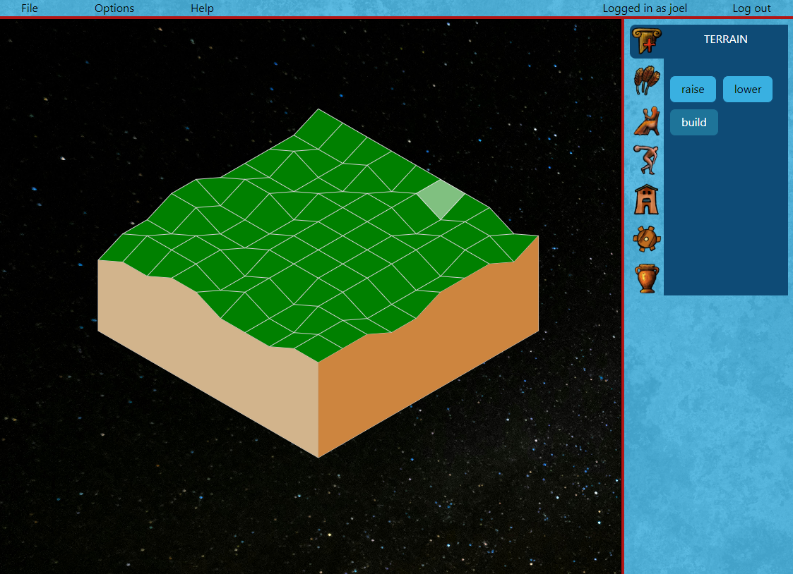

# Isometric game implemented in the browser

This is a casual attempt to make an isometric game / game engine.

I'm deliberately trying to discover these things myself. I.e. I want to enjoy making the thing not just try to make it as quickly as possible by copying someone else's code.

This basically is a grid of points and a grid of cells, rendered onto an html canvas. Each cell can have its height adjusted. There is click handling to calculate which position the mouse is in when it clicks, and to adjust that cell, triggering a re-render of the canvas.

Ideally I'll keep separate layers for the game engine and specific game things like images / specific interactions with the cells, so that it can be re-usable to make different sorts of things. I also want the rendering algorithms etc to be fairly hidden, so that these can be improved later (they seem to be okay right now, but I suspect a more optimal approach could be found if needed).

## to run

The code is separated into back end and front end.
**front end**

react attached to index.html, plus some javascript that manipulates a canvas element in the index.html.

- cd into `/client`
- `npm install`
- `npm run dev`
- run a server from this directory.

**back end**

Basic graphql server from Apollo Server, running on express (I think).

- cd into `/server`
- `npm install`
- `npm start`
- the graphql server is now running on localhost:4000

## General "architecture" overview

- `/client/render` handles rendering of the game world, in this case an isometric grid, with things drawn onto it. It also handles clicking inside of it. render will output which cells were clicked
- `/client/ui` an interface (in react, in this instance)
- `/client/state`
- `/server` a graphql server

Some notes on the various parts of this:

## Render - /client/render

- I built this thing first
- some maths. linear algebra for isometric calculation
- canvas elements. multiple, to make updating easier
- index.html
- classes for Grid, GridCell, GridPoint
- classes / etc, which abstract canvas element.
- GameRender class contains most of the wiring
- click handlers
- abstraction of click/hold handler
- drag (just changes x/y position of a div wrapping up all the canvas elements)
- typescript
- **calculation to find closest cell** (I was a bit proud of this)

## UI - /client/ui

- react
- styled components (I started to use tailwind in places. I didn't really vibe with it yet)
- overall layout component
- layout utilities (stack, cluster, etc)
- state / useState / useEffect etc
- calling server with Apollo Graphql Client useQuery, useMutation, etc
- ApolloClient puts an authorization token into its header, when it's there in state
- ...some hand drawn icons by me
- typescript
- attempt to ues elements / sections / etc
- puts the "render" element inside itself, though that element has nothing to do with React, on its own.
- webpack (I've used things like vite as well before)
- some helper methods for consistency. e.g. `<ModalInstance>`, `<SidePanelSection>`
- modal method displays component dynamically set by redux state
- dispatch actions to the state
- read values from the state

## State - /client/state

- react redux
- redux dev tools in the browser

## Server - /server

- node
- node debug
- Authorization class
- basic testing of the Authorization class
- typescript
- graphql - queries / mutations / etc.
- no db as of yet

## Inspiration

When growing up, I loved these games, in particular:

caesar 2

caesar 3

zeus

transport tycoon

rollercoaster tycoon

## grid <-> isometric maths

## Authorization / authentication

On the Apollo Server graphql server. Following this guide: https://www.apollographql.com/docs/apollo-server/security/authentication/ 

A token attached to the header 'authorization'. Used to look up a user at the server level.

## Notes (for me)

- apollo graphql playground (i.e. the thing running on localhost:4000) constantly polls the server to check the schema. This can be a little annoying if I want to set breakpoints in there. I could turn off that automatic polling: https://stackoverflow.com/questions/58038945/apollo-graphql-keeps-receiving-requests-with-no-queries-or-mutations-being-made 

## TODO tasks

some tasks I could could do...

- ~~make consistent the screen position + where the mouse is~~
- ~~figure out how to properly calculate the cell the mouse is over~~
- ~~add ability to move canvas with right click~~
- ~~build a little more robust interface to interact with the game thing~~
- ~~some abstraction for being able to control which images are rendered in cells~~
- ~~fix the thing with passing around Grid~~
- ~~probably make the Draw class a property contained in the abstract Canvas class? Then we never need to worry about passing a canvas to Draw methods.~~
- ~~add a back end to do something~~
- ~~add a graphql server~~
- ~~add authentication / authorization~~
- ~~find a way to trigger opening a modal from anywhere~~
- ~~make other canvas objects which sit above/below each other for different renderings~~
- ~~add some unit tests~~
- ~~find a way to highlight corners~~ / edges when mouse is over them
- ~~change build to use vite~~
- ~~make all the modal styling consistent with heading etc.~~
- ~~make constructor of the canvas elements programmatic from the class (probably is causing a bug currently, with multiple event listeners present, when re-initialising the whole thing)~~
- ~~fix up the styling~~ sort of
- build and animate a vehicle in blender to go into the game
- provide option for different canvas elements to become transparent.
- add rate limiting / traffic filtering for back end
- SSL / HTTPS for encryption
- add a function that will produce a 'string' version of the game grid (that could later be saved).
- add an ability to read in a string version of the grid, to initialise it.
- add 'save game state' to server
- find a way to render an image into a cell
- add a sql database?
- get push notifications from the server
- add proper typing to back end (some weird stuff with apollo typing. I think it's a slight nightmare.)
- import graphql types into front end by schema introspection
- handle login error messages
- fix the logic of centring the camera when creating a 'new game'. The width of some containing elements is not calculated correctly either (just a.... big number).
- clean up the initialisation of game-render and the 'reset' logic.
- add offScreenCanvas for calculations outside main execution thread
- look at moving some calculation logic to a web worker thread.
- calculate a minimap somehow