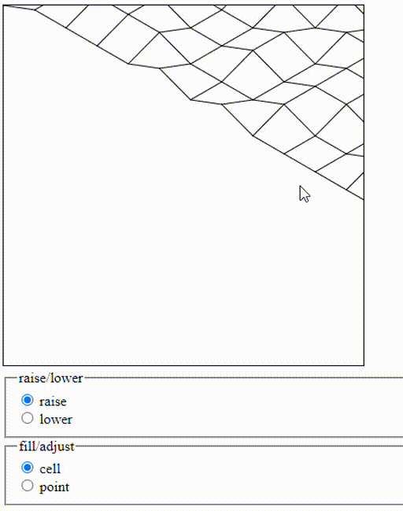
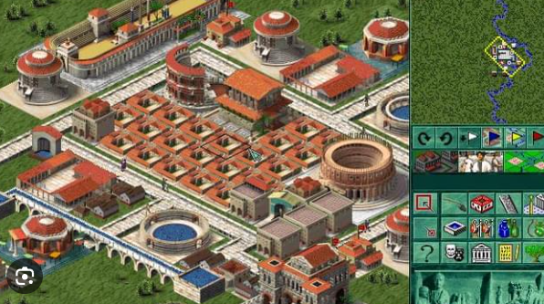
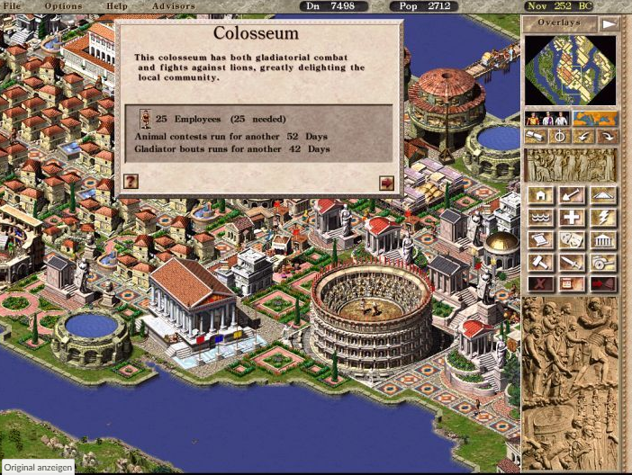
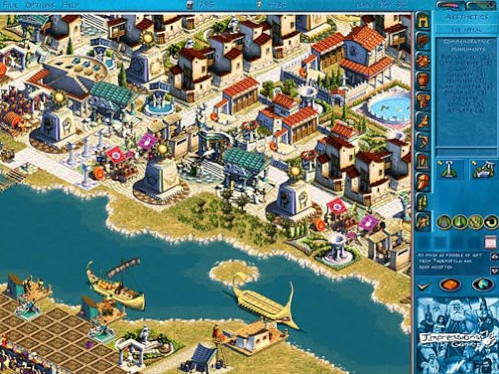
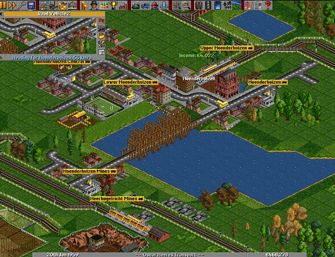
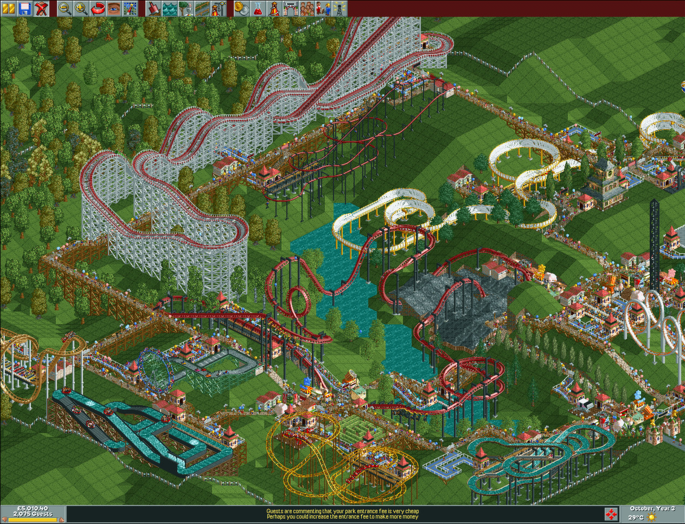
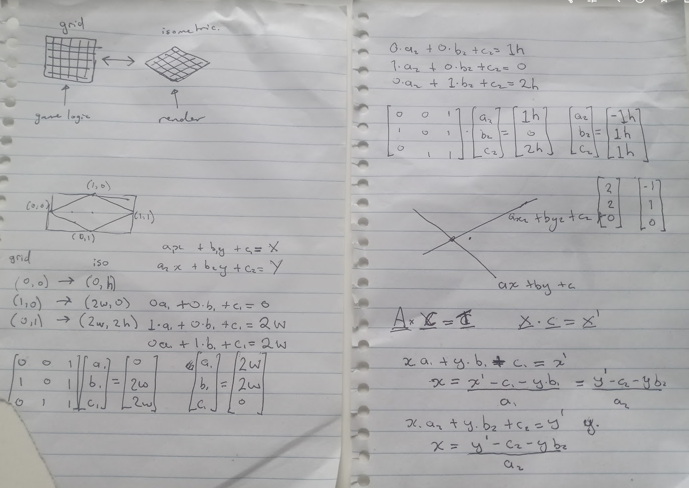

This is a casual attempt to make an isometric game / game engine.

I'm deliberately trying to discover these things myself. I.e. I want to enjoy making the thing not just try to make it as quickly as possible by copying someone else's code.

This basically is a grid of points and a grid of cells, rendered onto an html canvas. Each cell can have its height adjusted. There is click handling to calculate which position the mouse is in when it clicks, and to adjust that cell, triggering a re-render of the canvas.

Ideally I'll keep separate layers for the game engine and specific game things like images / specific interactions with the cells, so that it can be re-usable to make different sorts of things. I also want the rendering algorithms etc to be fairly hidden, so that these can be improved later (they seem to be okay right now, but I suspect a more optimal approach could be found if needed).

## to run

- `npm install`

**client** - react attached to index.html, plus some javascript that manipulates a canvas element in the index.html.

- `npm run dev`
- spin up a web server to run `index.html` in the browser. e.g. in vscode you could use the extension `LiveServer`

**server** - a graphql server (Apollo Server)
- `npm run start-server` - graphql server is now running on localhost:4000

## General "architecture" overview

- /render handles rendering of the game world, in this case an isometric grid, with things drawn onto it. It also handles clicking inside of it. render will output which cells were clicked
- some kind of representation of the world
- /ui an interface (in react, in this instance)
- /store (or some other directory) holds data about the state of the ui. E.g. 

## technologies

- **redux** used to record state that the UI has selected. I just want to use it.
- **typescript**
- **React** for the UI
- **Canvas** for rendering stuff. Why not.
- **Tailwindcss** ? For styling. I've never really used it, so I want to see what it's all about. The philosophy seems compelling.
- **testing** ? I could.
- **lit-html** for html templating outside react context (https://www.npmjs.com/package/lit-html) possibly. (originally I created a canvas element wrapped in some divs, to handle different things. It might be better or easier to use lit-html to define it in javascript. I just ran into this when exploring lit-elements, which is a framework to help make web-components)
- **authorization/authentication** - I'll follow some guides on apollo graphql for this https://www.apollographql.com/docs/apollo-server/security/authentication/ 

## Inspiration

When growing up, I loved these games, in particular:

caesar 2

caesar 3

zeus

transport tycoon

rollercoaster tycoon

## grid <-> isometric maths

## Authorization / authentication

On the Apollo Server graphql server. Following this guide: https://www.apollographql.com/docs/apollo-server/security/authentication/ 

A token attached to the header 'authorization'. Used to look up a user at the server level.

## tasks

some tasks I could could do...

- ~~make consistent the screen position + where the mouse is~~
- ~~figure out how to properly calculate the cell the mouse is over~~
- ~~add ability to move canvas with right click~~
- make other canvas objects which sit above/below each other for different renderings, and to be able to make some of them transparent if I feel like it.
- build a little more robust interface to interact with the game thing
- some abstraction for being able to control which images are rendered in cells
- find a way to highlight corners / edges when mouse is over them
- build and animate a vehicle in blender to go into the game
- fix the thing with passing around Grid
- ~~probably make the Draw class a property contained in the abstract Canvas class? Then we never need to worry about passing a canvas to Draw methods.~~

- add a back end to do something
- ~~add a graphql server~~
- add authentication / authorization
- add rate limiting / traffic filtering for back end
- SSL / HTTPS for encryption